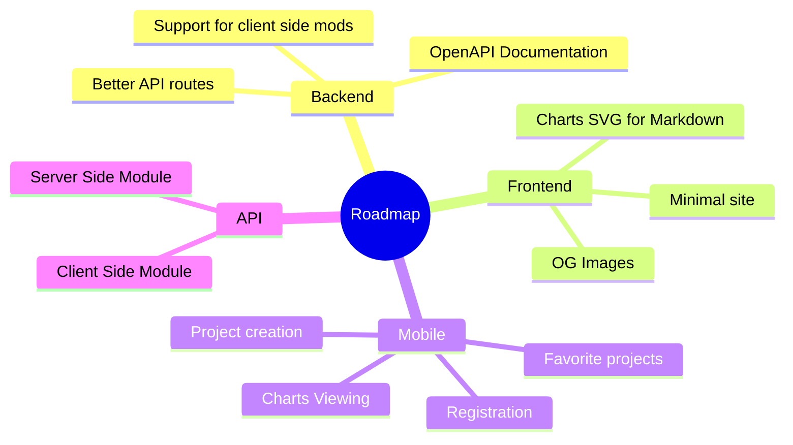

[![Contributors][contributors-shield]][contributors-url]
[![Forks][forks-shield]][forks-url]
[![Stargazers][stars-shield]][stars-url]
[![Issues][issues-shield]][issues-url]
[![MIT License][license-shield]][license-url]
[![LinkedIn][linkedin-shield]][linkedin-url]
[![Discord][discord-shield]][discord-url]
[![Modrinth][modrinth-shield]][modrinth-url]

 

  

<h3 align="center">fStats</h3>

  

    Fabric metric system for developers
     
    <a href="https://discord.gg/pbwnMwnUD6">Support</a>
    ·
    <a href="https://github.com/fstats/fstats-api/issues">Report Bug</a>
    ·
    <a href="https://github.com/fstats/fstats-api/issues">Request Feature</a>
  

  
Table of Contents

  <ol>
    <li>
      <a href="#about-the-project">About The Project</a>
    </li>
    <li><a href="#usage">Usage</a></li>
    <li><a href="#roadmap">Roadmap</a></li>
    <li><a href="#contributing">Contributing</a></li>
    <li><a href="#license">License</a></li>
  </ol>

## About The Project

fStats allows you to collect usage data for your Fabric mods. Currently it support only server side. Client side is on plan.

(<a href="#readme-top">back to top</a>)

## Usage

Usage instraction is available on [offical website](https://fstats.dev/how-to-start)

(<a href="#readme-top">back to top</a>)

## Roadmap

See the [open issues](https://github.com/fstats/fstats-api/issues) for a full list of proposed features (and known issues).

(<a href="#readme-top">back to top</a>)

## Contributing

Contributions are what make the open source community such an amazing place to learn, inspire, and create. Any contributions you make are **greatly appreciated**.

If you have a suggestion that would make this better, please fork the repo and create a pull request. You can also simply open an issue with the tag "enhancement".
Don't forget to give the project a star! Thanks again!

1. Fork the Project
2. Create your Feature Branch (`git checkout -b feature/AmazingFeature`)
3. Commit your Changes (`git commit -m 'Add some AmazingFeature'`)
4. Push to the Branch (`git push origin feature/AmazingFeature`)
5. Open a Pull Request

(<a href="#readme-top">back to top</a>)

## License

Distributed under the MIT License. See `LICENSE.txt` for more information.

(<a href="#readme-top">back to top</a>)

[contributors-shield]: https://img.shields.io/github/contributors/fstats/fstats-api.svg?style=for-the-badge
[contributors-url]: https://github.com/fstats/fstats-api/graphs/contributors

[forks-shield]: https://img.shields.io/github/forks/fstats/fstats-api.svg?style=for-the-badge
[forks-url]: https://github.com/fstats/fstats-api/network/members

[stars-shield]: https://img.shields.io/github/stars/fstats/fstats-api.svg?style=for-the-badge
[stars-url]: https://github.com/fstats/fstats-api/stargazers

[issues-shield]: https://img.shields.io/github/issues/fstats/fstats-api.svg?style=for-the-badge
[issues-url]: https://github.com/fstats/fstats-api/issues

[license-shield]: https://img.shields.io/github/license/fstats/fstats-api.svg?style=for-the-badge
[license-url]: https://github.com/fstats/fstats-api/blob/master/LICENSE.txt

[linkedin-shield]: https://img.shields.io/badge/-LinkedIn-black.svg?style=for-the-badge&logo=linkedin&colorB=555
[linkedin-url]: https://linkedin.com/in/kit-lehto

[discord-shield]: https://img.shields.io/discord/1032138561618726952?logo=discord&logoColor=white&style=for-the-badge&label=Discord
[discord-url]: https://discord.gg/pbwnMwnUD6

[modrinth-shield]: https://img.shields.io/modrinth/v/fstats-api?label=Modrinth&style=for-the-badge
[modrinth-url]: https://modrinth.com/mod/fstats
